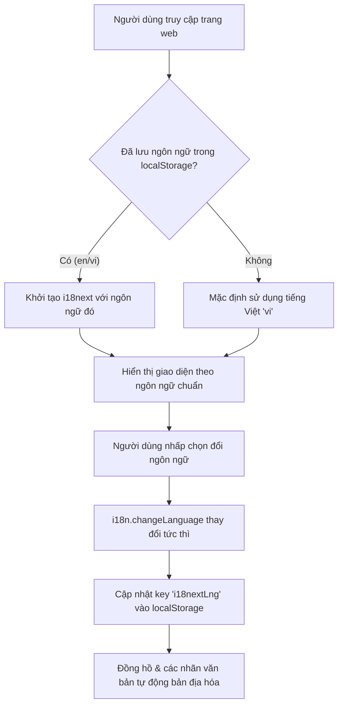

# 2. Hướng Dẫn Triển Khai Bộ Chuyển Đổi Ngôn Ngữ (Language Switcher)

Tài liệu này chi tiết hóa cách thức hoạt động của tính năng đổi ngôn ngữ toàn hệ thống (Anh/Việt) có khả năng ghi nhớ trạng thái bằng `localStorage` trong dự án `erp-corporation-fe-v2`.

---

## 1. Luồng Hoạt Động (Workflow)

1. **Khởi động ứng dụng**: `src/lib/i18n.ts` đọc giá trị khóa `i18nextLng` từ `localStorage`. Nếu không có, mặc định thiết lập là `'vi'` (Tiếng Việt).
2. **Hiển thị**: Toàn bộ nhãn, văn bản hiển thị thông qua hàm `t()` của hook `useTranslation` từ `react-i18next`.
3. **Thao tác chuyển đổi**:
   - Khi click nút Globe hoặc chọn trong Avatar dropdown, ứng dụng sẽ gọi hàm `i18n.changeLanguage(nextLang)`.
   - Đồng thời, thực hiện lưu trữ giá trị mới: `localStorage.setItem('i18nextLng', nextLang)`.
4. **Cập nhật UI**: `react-i18next` sẽ phát đi sự kiện thay đổi và React render lại các phần văn bản tương ứng mà không cần phải tải lại trang (Zero reload).

---

## 2. Các File Thay Đổi / Liên Quan

1. **[MODIFY] [i18n.ts](file:///c:/Projects/DigiFnb/ERP_CORPORATION/erp-corporation-fe-v2/src/lib/i18n.ts)**:
   - Thay đổi biến khởi tạo `lng` từ hardcode `'vi'` sang đọc từ `localStorage.getItem('i18nextLng') || 'vi'`.
2. **[NEW] [Header.tsx](file:///c:/Projects/DigiFnb/ERP_CORPORATION/erp-corporation-fe-v2/src/components/layout/Header.tsx)**:
   - Tích hợp nút Globe ngoài màn hình (Guest) và tùy chọn trong Dropdown (Auth).
   - Hàm `toggleLanguage` và `handleLanguageChange` thay đổi ngôn ngữ qua `i18n.changeLanguage` và cập nhật lưu trữ `localStorage`.
3. **[NEW] [CurrentTime.tsx](file:///c:/Projects/DigiFnb/ERP_CORPORATION/erp-corporation-fe-v2/src/components/layout/CurrentTime.tsx)**:
   - Lắng nghe sự thay đổi ngôn ngữ qua hook `useTranslation()` để tự động cập nhật định dạng hiển thị giờ và thứ ngày tháng tương ứng.
4. **[NEW] [NotificationPopover.tsx](file:///c:/Projects/DigiFnb/ERP_CORPORATION/erp-corporation-fe-v2/src/components/layout/NotificationPopover.tsx)**:
   - Tự động thay đổi tiêu đề, nội dung và thời gian của thông báo (Ví dụ: "5 phút trước" -> "5 mins ago") dựa vào ngôn ngữ hiện tại.

---

## 3. Tiêu Chí & Đề Xuất Cải Tiến Chuyên Nghiệp (Best Practices)

Để cải thiện hơn nữa tính chuyên nghiệp của hệ thống đa ngôn ngữ trong tương lai, chúng ta nên hướng tới các tiêu chí sau:

* **Định dạng số và tiền tệ (Currency & Number Formatting)**:
  - Nên xây dựng helper sử dụng `Intl.NumberFormat` liên kết chặt chẽ với ngôn ngữ đang chọn để tự động đổi định dạng dấu phẩy/chấm (Ví dụ: `1,000.50 USD` vs `1.000,50 đ`).
* **Đồng bộ hóa ngôn ngữ về Hồ sơ Người dùng (Database sync)**:
  - Ngoài `localStorage` phục vụ cho thiết bị hiện tại, khi user đã đăng nhập, lựa chọn ngôn ngữ nên được gửi API lưu vào bảng cấu hình Profile cá nhân trên DB. Điều này giúp khi họ đăng nhập trên máy tính khác hoặc điện thoại, ngôn ngữ vẫn tự động đồng bộ theo thói quen của họ.
* **Tự động phát hiện vị trí (Language Detection)**:
  - Có thể sử dụng thư viện `i18next-browser-languagedetector` để tự động phát hiện ngôn ngữ của trình duyệt hệ điều hành khi người dùng lần đầu tiên truy cập hệ thống.
* **Tối ưu SEO với thẻ `<html lang="...">`**:
  - Nên tích hợp cập nhật thuộc tính `lang` của thẻ `<html>` trong file `index.html` mỗi khi ngôn ngữ thay đổi (Sử dụng lệnh `document.documentElement.lang = i18n.language`). Điều này giúp các bộ máy tìm kiếm (Google, Bing) thu thập dữ liệu đúng ngôn ngữ và tăng thứ hạng SEO.
